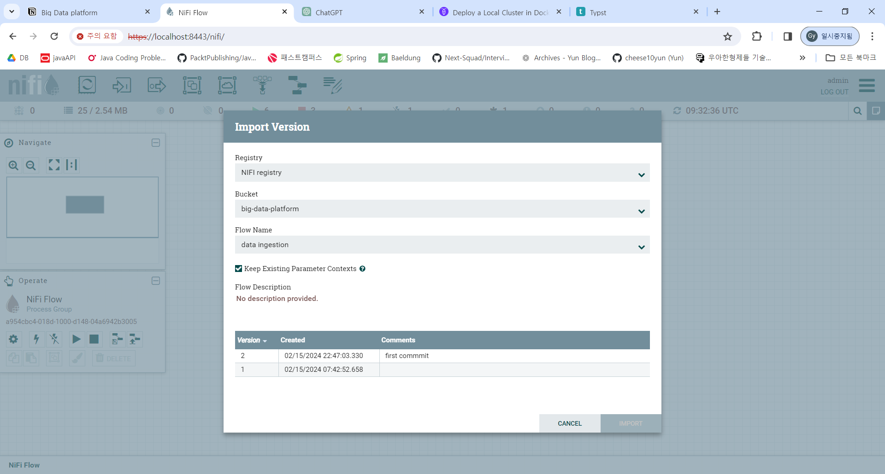
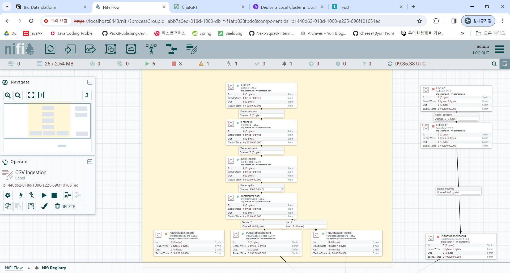
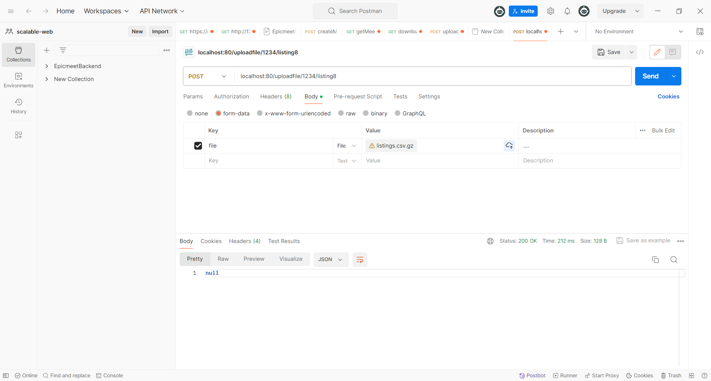

# This is a deployment/installation guide

It is a free form. you can use it to explain how to deploy/install and run  your code. Note that this deployment/installation guide ONLY helps to run your assignment. **It is not where you answer your solution for the assignment questions**


### 1. Clone the repo
### 2. Run the docker compose up
```
cd code
docker compose up --build
```
### 3. Perform a one-time initialization of the cluster.
```
docker exec -it roach1 ./cockroach --host=roach1:26357 init --insecure
```

### 4. View nifi UI on the web browser at https://localhost:8443/nifi
it will take some time to run the nifi server.

### 5. Import a flow from the registry using the process group
the name of the bucket will be big-data-platform and the flow name is data ingestion


### 6. Run all the processes inside the csv ingestion.
 

### 4. send a POST request to http://localhost:80/uploadfile/{tenant_id}/{table_name} with file attached.

if you receive null response, then the quest has been succesful.


### 6. query the database inside the SQL shell
```docker exec -it roach1 ./cockroach sql --host=roach1:26257 --insecure```
